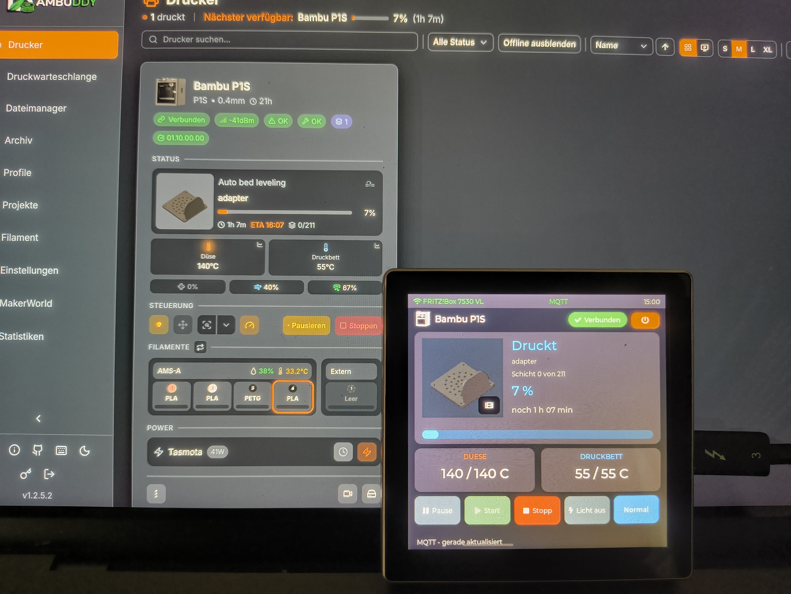
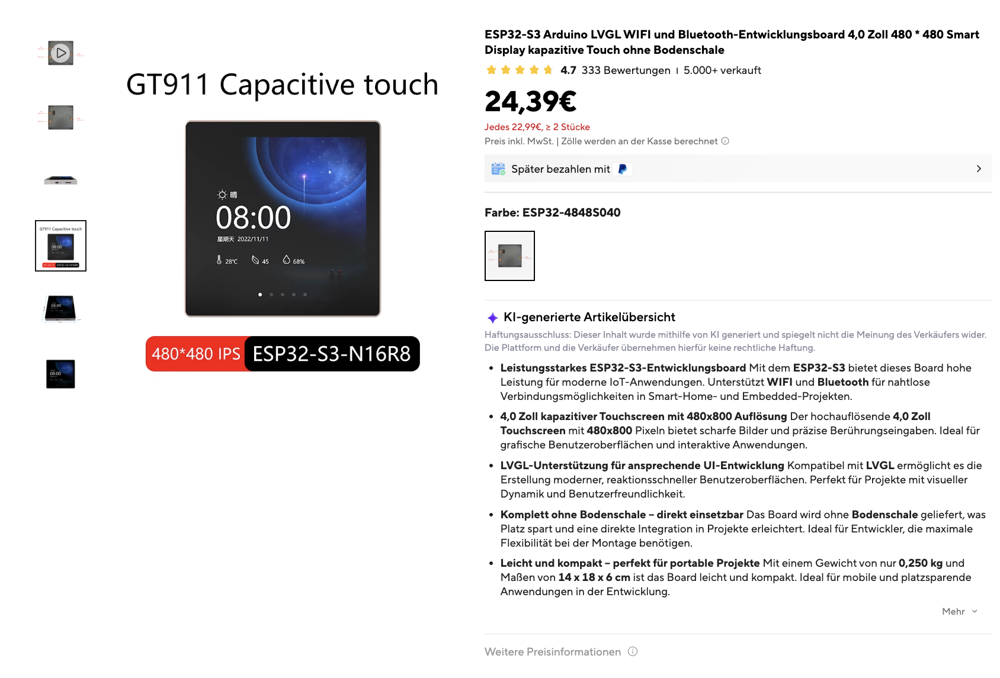
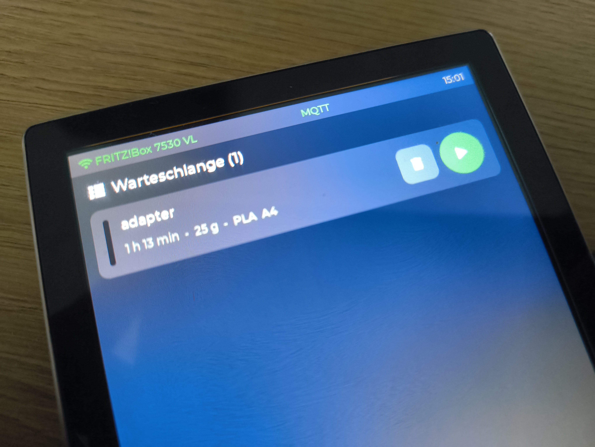
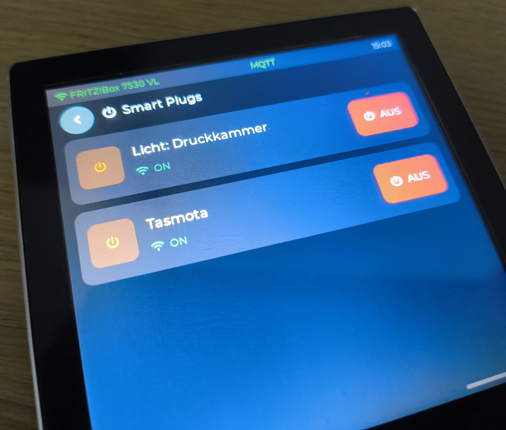
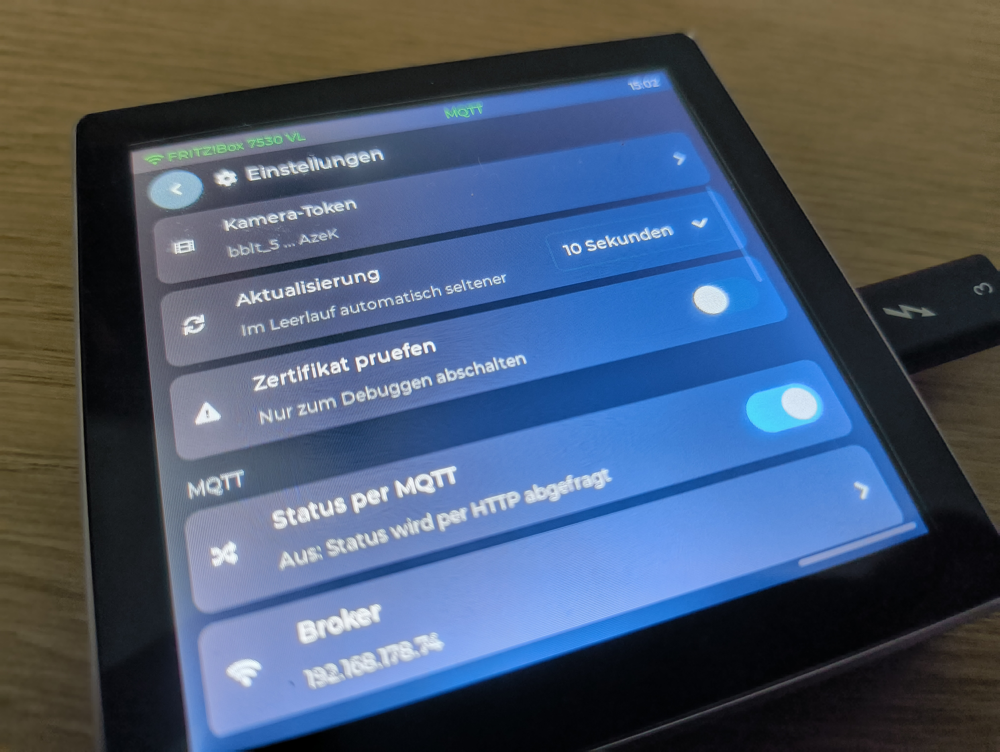
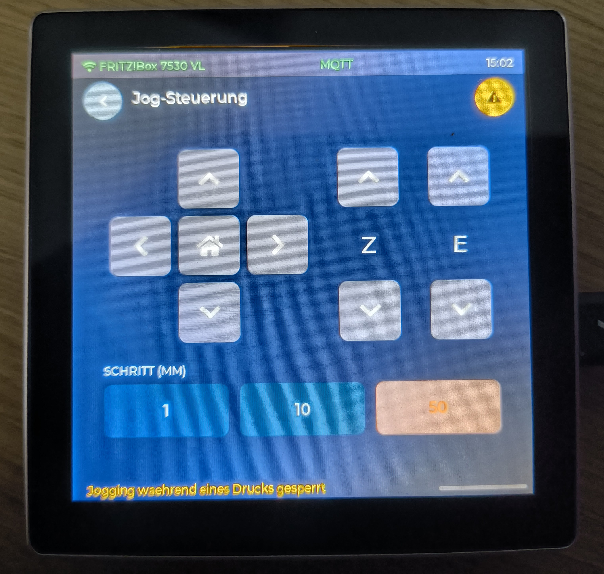
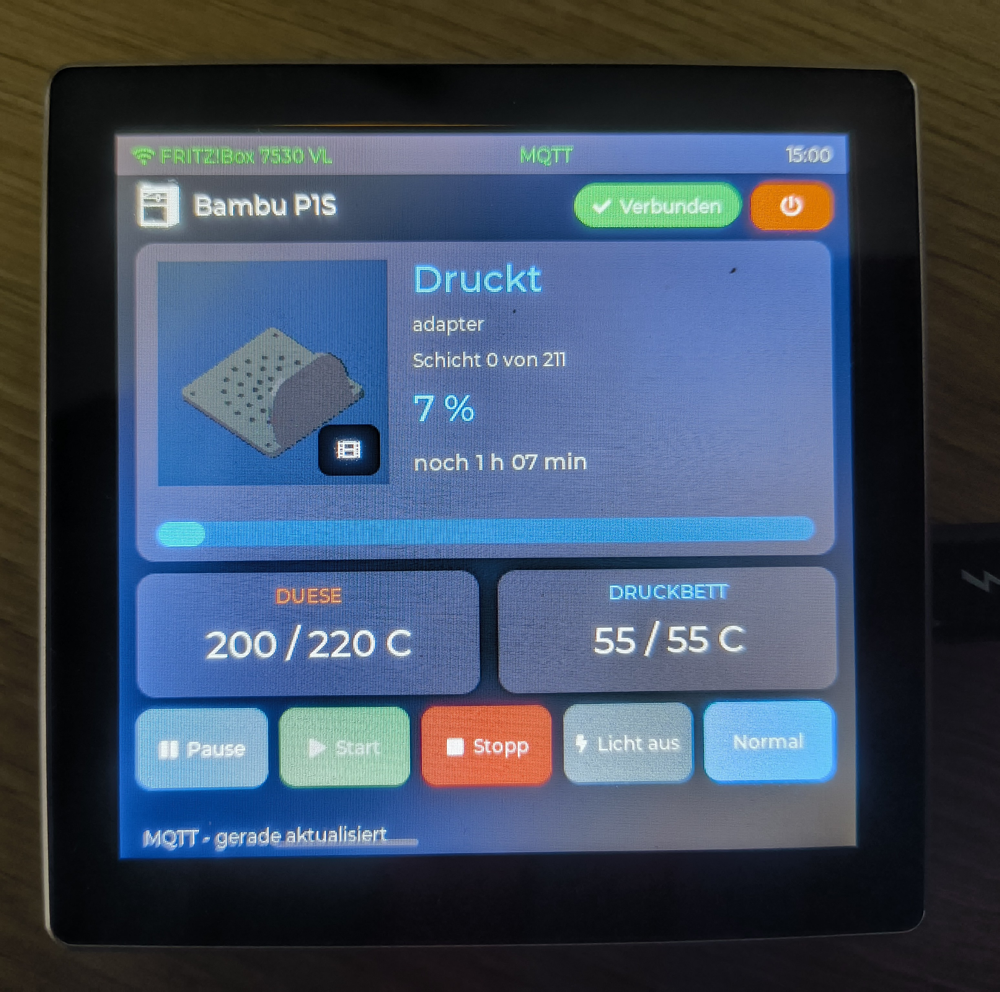
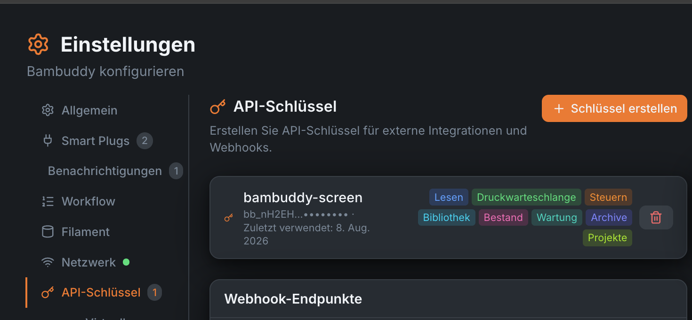

# Bambuddy Display for ESP32-4848S040CI

Touch display for Bambuddy on the **Sunton ESP32-4848S040CI / ESP32-4848S040CIY1**.

This project brings Bambuddy directly to a 4.0" ESP32 touch display: printer status, AMS, queue, archive, camera snapshot, and smart plug controls on a compact panel next to your printer.

<p>
  
  
  
  
  
</p>

ESP32-S3 touchscreen companion for **Bambuddy** and **Bambu Lab** printers, built with **LVGL** and **PlatformIO**.

**Powered by Bambuddy**

<p>
  
</p>

## What is this?

`bambuddy-display` is a native LVGL interface for an ESP32-S3 display board. The device connects to your Bambuddy instance and shows key printer information directly on the touchscreen.

It is built to work with [Bambuddy](https://github.com/maziggy/bambuddy), a self-hosted command center for Bambu Lab printers, and uses Bambuddy's REST API for device data and actions. Bambuddy also provides API reference documentation in its docs and repository.

Current features:

- Live printer status for Bambu printers
- AMS view
- Queue view with start actions
- Archive view with reprint and delete
- Printer camera snapshot
- Smart plug controls
- Wi-Fi setup directly on the device
- Bambuddy configuration for HTTP or MQTT

## Target Hardware

This project is built for the following board:

- **Sunton ESP32-4848S040CI**
- PlatformIO board ID: `esp32-4848S040CIY1`
- ESP32-S3
- 480x480 touch display
- 4.0 inch
- USB-C for power and flashing

<p>
  
</p>

If you mean that square ESP32 touchscreen board with USB-C: yes, this is the one.

## Gallery

### Bambuddy and Bambuddy Screen in Action

<table>
  <tr>
    <td align="center" width="50%">
      
    </td>
    <td align="center" width="50%">
      
    </td>
  </tr>
  <tr>
    <td align="center" width="50%">
      
    </td>
    <td align="center" width="50%">
      
    </td>
  </tr>
  <tr>
    <td align="center" colspan="2">
      
    </td>
  </tr>
</table>

More photos are available in [`docs/`](docs/).

## Get Started

### 1. Get the hardware

You need:

- a **Sunton ESP32-4848S040CI** display board
- a **USB-C data cable**
- a computer with PlatformIO
- a running **Bambuddy** instance

### 2. Clone the repo

```bash
git clone <your-repo-url>
cd bambuddy-display
```

### 3. Prepare your config

`include/secrets.example.h` is the template for your initial configuration.

```bash
cp include/secrets.example.h include/secrets.h
```

Then fill in `include/secrets.h` with:

- `BAMBUDDY_DEFAULT_URL`
- `BAMBUDDY_DEFAULT_API_KEY`
- `BAMBUDDY_DEFAULT_PRINTER_ID`
- optional camera token
- optional MQTT credentials

The API key can be created directly in Bambuddy under **Settings -> API Keys**.

<p>
  
</p>

Important: these values are only the **initial defaults for the first boot**. After that, the display stores its own settings in NVS.

### 4. Build the firmware

```bash
pio run
```

### 5. Flash the board

Connect the board via **USB-C**, then run:

```bash
pio run --target upload
```

Open the serial monitor:

```bash
pio device monitor
```

## First Boot

After flashing:

1. Power up the display over USB-C
2. Configure Wi-Fi on the device
3. Verify the Bambuddy URL and API access
4. Set the printer ID
5. Optionally switch to MQTT

At that point, the display should start showing live printer status.

## UI Layout

The interface is built as a horizontal tile view:

- **AMS**
- **Status**
- **Queue**
- **Archive**
- **System**

Inside the system area you will find:

- Wi-Fi
- Settings
- Smart Plugs
- Jog controls

## Connection to Bambuddy

The display supports two data sources:

- **HTTP polling**
- **MQTT**

MQTT is a good choice if you want status changes to appear on the display as quickly as possible. HTTP is the simpler option to get started.

This project primarily talks to Bambuddy through its REST API, with optional MQTT support for faster status updates.

## Development

### Stack

- PlatformIO
- Arduino framework
- ESP32-S3
- LVGL 9.2.2
- `esp32-smartdisplay`

### Design system

`src/ui_theme.h` holds the tokens — surface levels, text colours, meaning
colours (ok / warn / error / accent), plus a spacing and radius scale — in two
palettes; `ui_theme_set_dark()` picks one at startup. `src/ui_kit.h` builds
everything from them: cards, tiles, buttons, icon buttons, status pills,
overline captions, values, rules and progress bars. Screens should reach for
those instead of styling objects by hand, so a change of look happens in one
place.

Switching the palette needs a restart — the screens carry their colours in the
objects, and re-theming at runtime would only repaint what LVGL itself owns.
The settings switch says so and restarts on confirmation.

### Fonts

The built-in LVGL Montserrat faces only cover ASCII, so umlauts and accents —
in the UI and in file names coming from Bambuddy — rendered as empty boxes.
`src/fonts/` holds replacements covering Latin-1 (0xA0–0xFF) on top of the
same glyph set the built-ins use; `src/ui_font.h` documents the
`lv_font_conv` command that generates them. Anything beyond Latin-1 (Chinese
model names, em dashes, typographic quotes) still renders as a box.

### Build

```bash
pio run
```

### Upload

```bash
pio run --target upload
```

### Monitor

```bash
pio device monitor
```

### Releases

`version.txt` in the repo root holds the firmware version — a single line,
e.g. `1.0.1`. It is used twice: `pre_build.py` compiles it into the firmware
(shown on the update page), and `release.sh` names the released binary after
it.

```bash
./release.sh            # copy the current build
./release.sh --build    # run "pio run" first
./release.sh --force    # replace an existing file of the same version
```

The result lands in `firmware-build/`:

```
firmware-build/bambuddy-display-v1.0.1.bin
```

The script prints size (including how much of the 1.92 MB OTA partition it
uses), build time, SHA-256 and the **build id** — the first 8 bytes of the ELF
hash the IDF embeds into the image. The update page shows the same 8
characters, which is how you confirm the board is really running the file you
just uploaded. It refuses to overwrite an existing release of the same version
and warns when sources are newer than the build.

### Web update (OTA)

Settings → **FIRMWARE** → *Web-Update*. While the switch is on, the device runs
a small web server on port 80; the row underneath shows the address to open
(e.g. `http://192.168.1.23`). The page lists the running firmware — version,
build time, build id, size, active OTA partition, free space — and takes a
`.bin` from `firmware-build/` (or `firmware.bin` straight out of
`.pio/build/esp32-4848S040CIY1/`). After the last byte the board reboots into
the new image.

The switch is off by default and its state survives a restart. While it is on,
anyone on the same network can flash the device: there is no password.

## Tested With

Tested against a private **Bambuddy v1.2.5.3** instance on a **Bambu Lab P1S v01.10.00.00**.

## Project Status

This is no longer a generic display demo. It is a dedicated **Bambuddy companion display** for Bambu printers.

Firmware can now be updated from the browser (see *Web update*); the first
flash still needs USB.

## Thanks

Thanks to the [Bambuddy project](https://github.com/maziggy/bambuddy) and its REST API.
